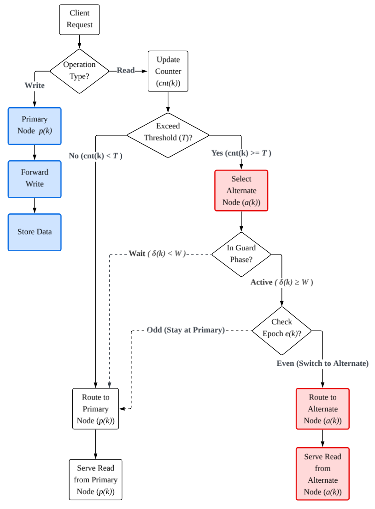

분산 캐시 시스템의 성능을 극대화하기 위해 트래픽을 여러 노드로 분산하다 보면 반드시 마주치는 숙제가 있다. 바로 **데이터 정합성(Consistency)** 문제다.

**D-HASH**는 핫키 트래픽을 주 노드(Primary)와 대체 노드(Alternate)로 나누어 처리한다. 이때 읽기(Read)뿐만 아니라 쓰기(Write)까지 여러 노드에 분산하게 되면, 클라이언트마다 서로 다른 노드의 데이터를 참조하게 되어 최신 데이터가 반영되지 않는 데이터 불일치 현상이 발생할 수 있다. 

이 문제를 원천 차단하기 위해 D-HASH에 적용한 **Write-Primary 정책**의 설계 의도와 구현 내용을 정리했다.

---

## 쓰기 트래픽 분산은 데이터 파편화와 불일치 문제를 야기한다

### 여러 노드에 데이터가 흩어지면 정합성 유지가 어려워진다
D-HASH는 핫키 감지 시 주 노드 외에 별도의 대체 노드를 선정한다. 만약 라우팅 로직이 읽기와 쓰기를 구분하지 않고 분산한다면 다음과 같은 결함이 발생한다.

* 특정 클라이언트가 대체 노드에 값을 업데이트하더라도, 주 노드를 참조하는 다른 클라이언트는 업데이트 이전의 과거 데이터를 읽게 된다.
* 노드 간 별도의 실시간 동기화 메커니즘이 없다면 데이터 파편화로 인해 시스템 전체의 신뢰도가 하락한다.

### 복잡한 동기화 메커니즘 대신 라우팅 정책으로 문제를 해결했다
모든 캐시 노드 간의 실시간 복제(Replication)는 네트워크 오버헤드와 구현 복잡도를 급격히 증가시킨다. D-HASH는 **"쓰기 경로를 주 노드로 단일화"**하는 전략을 통해 클라이언트 사이드에서 정합성 문제를 간단히 해결했다.

---

## 모든 쓰기 작업은 반드시 주 노드에서만 수행하도록 강제한다

데이터의 최신 상태를 보장하는 'Source of Truth'를 유지하기 위해, 모든 변경 작업은 해시 링 상의 원래 주인인 주 노드(Primary)가 전담한다.

### 연산 타입에 따라 라우팅 대상을 엄격히 분리했다
* **쓰기(Write) 연산**: 데이터 일관성을 최우선으로 하여, 키의 핫키 여부와 상관없이 항상 주 노드로만 라우팅한다.
* **읽기(Read) 연산**: 일반 키는 주 노드에서 처리하며, 핫키로 승격된 경우에만 주 노드와 대체 노드 사이에서 트래픽을 분산한다.

### 소스 코드에 반영된 쓰기 고정 로직을 확인했다
D-HASH의 라우팅 API인 `get_node` 함수는 가장 먼저 연산 타입(`op`)을 확인하여 쓰기 요청을 주 노드로 격리한다.

~~~python

def get_node(self, key: Any, op: str = "read") -> str:
    # 1. 쓰기 일관성(Write Consistency): 모든 쓰기 요청은 핫키 여부와 무관하게 주 노드로 라우팅
    if op == "write":
        return self._primary_safe(key)

    # 2. 읽기 요청의 경우에만 핫키 감지 및 동적 라우팅 로직 수행
    cnt = self.reads.get(key, 0) + 1
    self.reads[key] = cnt
~~~

### 3. 일관성과 가용성을 동시에 잡기 위해 Dual Write 시뮬레이션을 활용했다
쓰기는 주 노드가 전담하지만, 읽기 분산 시 대체 노드에서 발생할 수 있는 캐시 미스를 방지하기 위해 벤치마크 환경에서는 쓰기 시점에 대체 노드에도 데이터를 함께 기록하는 과정을 거친다. 이를 통해 데이터의 **최신성**은 주 노드가 담보하고, **읽기 가용성**은 대체 노드가 보조하는 구조를 완성했다.

---

## 주 노드 전담 쓰기 정책은 데이터 신뢰성과 시스템 안정성을 보장한다

### 복잡한 복제 없이도 데이터 정합성을 확실히 보장한다
모든 업데이트가 단일 지점(Primary)에서 이루어지므로, 분산 캐시 환경에서도 클라이언트가 과거 데이터를 읽게 되는 위험을 원천적으로 차단했다.

### 읽기 중심 서비스 환경에서 최적의 효율을 보여준다
이 정책은 쓰기 부하를 주 노드에 집중시키지만, 대부분의 대규모 서비스는 **읽기 비중이 압도적으로 높은(Read-Intensive)** 특성을 가진다. 따라서 쓰기 성능을 일부 희생하더라도 데이터 신뢰성을 확보하는 것이 전체 아키텍처 관점에서 훨씬 유리한 선택이었다.

분산 시스템 개발에서 알고리즘의 효율성만큼이나 중요한 것은 데이터의 신뢰성이다. D-HASH의 **Write-Primary** 정책은 라우팅 레이어에서의 단순한 분기만으로 분산 환경의 고질적인 정합성 문제를 해결하는 실용적인 해법이 되었다.